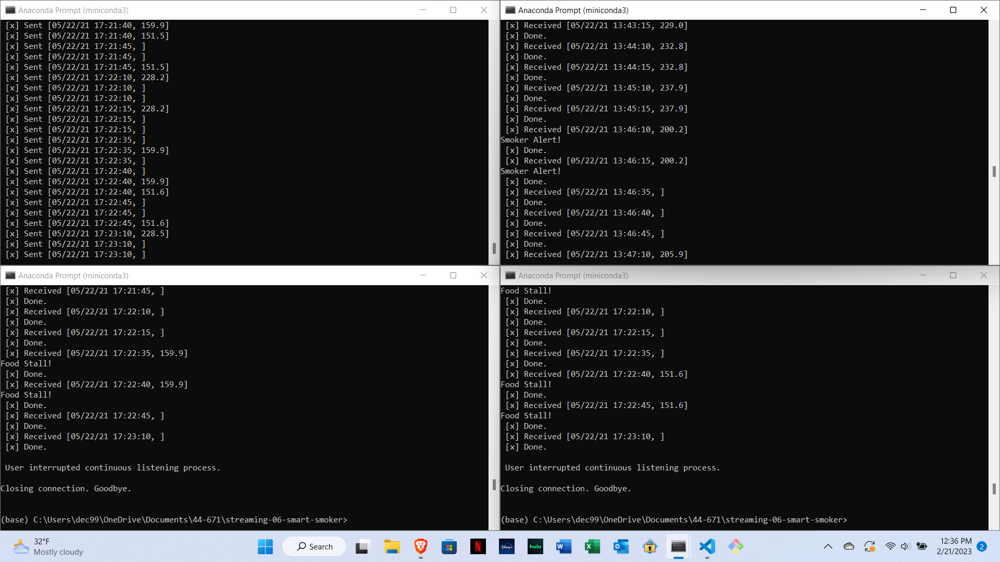

# streaming-06-smart-smoker

Name: Deanna Clayton
Date: 2/20/23

## Smart Smoker
# Using a Barbeque Smoker
When running a barbeque smoker, we monitor the temperatures of the smoker and the food to ensure everything turns out tasty. Over long cooks, the following events can happen:
1. The smoker temperature can suddenly decline. 
2. The food temperature doesn't change. At some point, the food will hit a temperature where moisture evaporates. It will stay close to this temperature for an extended period of time while the moisture evaporates (much like humans sweat to regulate temperature). We say the temperature has stalled.
 
# Sensors
We have temperature sensors track temperatures and record them to generate a history of both (a) the smoker and (b) the food over time. These readings are an example of time-series data, and are considered streaming data or data in motion.

# Streaming Data
Our thermometer records three temperatures every thirty seconds (two readings every minute). The three temperatures are:
1. the temperature of the smoker itself.
2. the temperature of the first of two foods, Food A.
3. the temperature for the second of two foods, Food B.
 
# Significant Events
We want know if:
1. The smoker temperature decreases by more than 15 degrees F in 2.5 minutes (smoker alert!)
2. Any food temperature changes less than 1 degree F in 10 minutes (food stall!)
 
# Smart System
We will use Python to:
1. Simulate a streaming series of temperature readings from our smart smoker and two foods.
2. Create a producer to send these temperature readings to RabbitMQ.
3. Create three consumer processes, each one monitoring one of the temperature streams. 
4. Perform calculations to determine if a significant event has occurred.

## Assignment
We want to stream information from a smart smoker. Read one value every half minute. (sleep_secs = 30)

smoker-temps.csv has 4 columns:

[0] Time = Date-time stamp for the sensor reading
[1] Channel1 = Smoker Temp --> send to message queue "01-smoker"
[2] Channel2 = Food A Temp --> send to message queue "02-food-A"
[3] Channel3 = Food B Temp --> send to message queue "03-food-B"

# Requirements
RabbitMQ server running
pika installed in your active environment
RabbitMQ Admin:
See http://localhost:15672/Links to an external site.

# General Design Questions
1. How many producers processes do you need to read the temperatures:
2. How many queues do we use: 
3. How many listening callback functions do we need (Hint: one per queue): 

## Screenshot

Screenshot of terminals with their alerts

